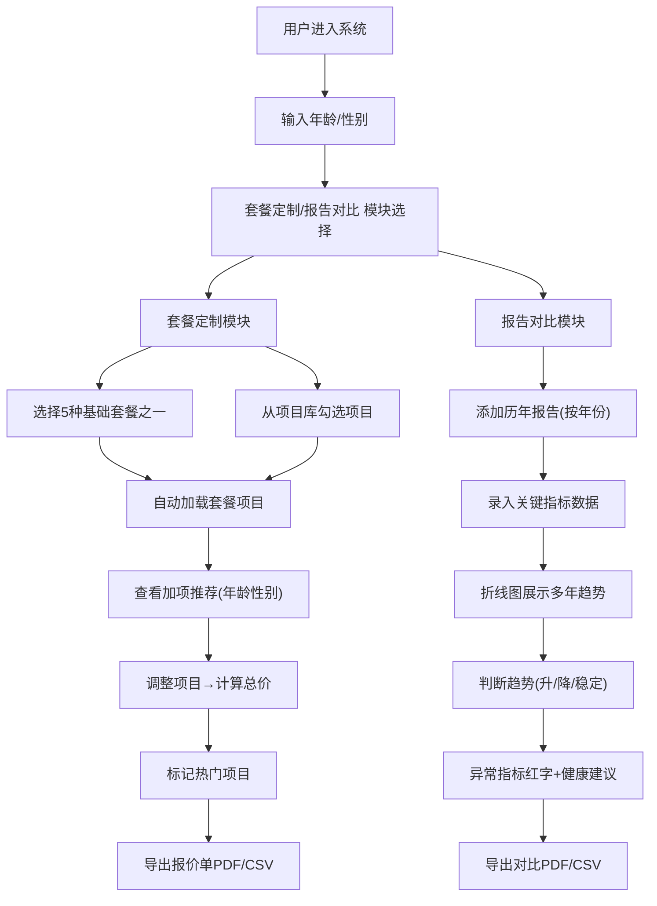

# 体检中心套餐定制与历年报告对比工具 - 产品需求文档

## 1. 产品概述

本产品是一款面向体检中心用户的在线工具，提供体检套餐定制、历年健康报告对比分析及个性化健康建议服务。解决用户在体检项目选择、健康数据追踪分析方面的痛点，提升体检中心用户体验与服务附加值。

- **目标用户**：需要定制体检套餐、对比历年体检数据的个人用户
- **核心价值**：套餐灵活定制、历年数据可视化对比、智能健康建议
- **目标场景**：体检前套餐选择、体检后健康数据追踪分析

## 2. 核心功能

### 2.1 用户角色
本产品为单用户角色，无需登录，数据保存在浏览器本地。

| 角色 | 说明 | 核心权限 |
|------|------|----------|
| 普通用户 | 终端使用者 | 套餐定制、报告录入、对比分析、数据导出 |

### 2.2 功能模块
1. **套餐定制页**：基础套餐展示、项目库勾选、价格计算、热门项目标记、加项推荐
2. **历年报告对比页**：报告录入、指标数据管理、折线图可视化、趋势判断、健康建议
3. **导出中心**：套餐报价单导出(PDF/CSV)、体检报告对比导出(PDF/CSV)
4. **用户信息面板**：年龄、性别输入(用于加项推荐)

### 2.3 页面详情

| 页面名称 | 模块名称 | 功能描述 |
|-----------|-------------|---------------------|
| 套餐定制页 | 头部导航 | 品牌标识、功能模块切换 |
| 套餐定制页 | 用户信息卡 | 年龄性别输入、智能加项推荐触发 |
| 套餐定制页 | 基础套餐区 | 5个预设套餐卡片、一键选入 |
| 套餐定制页 | 项目库勾选区 | 分类展示所有体检项目、勾选/取消、价格显示、热门标记 |
| 套餐定制页 | 已选项目汇总栏 | 已选项目清单、单项移除、原价/优惠价、总价统计 |
| 套餐定制页 | 加项推荐区 | 根据年龄性别推荐3个可选加项 |
| 套餐定制页 | 导出操作区 | 导出报价单PDF、导出CSV |
| 报告对比页 | 报告管理区 | 年份选择、新增报告、删除报告 |
| 报告对比页 | 指标录入表单 | 血压、血糖、总胆固醇等关键指标录入 |
| 报告对比页 | 指标趋势图 | 折线图展示多年数据变化、曲线颜色区分 |
| 报告对比页 | 趋势分析区 | 判断"逐年升高/降低/稳定"并显示 |
| 报告对比页 | 异常指标区 | 红字显示异常指标、预设规则生成健康建议 |
| 报告对比页 | 导出操作区 | 导出对比PDF、导出历年指标CSV |

## 3. 核心流程

用户操作核心流程描述：
1. 进入系统 → 输入年龄性别 → 浏览基础套餐 → 选择套餐或从项目库勾选 → 查看智能加项推荐 → 调整已选项目 → 确认总价 → 导出报价单
2. 进入报告对比模块 → 添加历年报告 → 录入各年份指标数据 → 查看趋势折线图 → 识别异常指标与健康建议 → 导出对比报告与CSV

## 4. 用户界面设计

### 4.1 设计风格
- **主色调**：医疗健康绿 `#10B981`（主色）、深海蓝 `#1E40AF`（辅助色）
- **辅色调**：警示红 `#EF4444`（异常指标）、橙黄 `#F59E0B`（热门标记）
- **中性色**：象牙白背景、浅灰卡片、深灰文字
- **按钮风格**：圆角8px、渐变填充、hover时微微上浮+阴影加深
- **字体**：标题用 "Noto Serif SC" 衬线体体现专业感，正文用 "Noto Sans SC" 无衬线体保证可读性
- **布局风格**：卡片式布局、分段Tab导航、左右分栏（选项区+汇总区）
- **图标风格**：统一线性图标，使用Unicode或CSS绘制，保持简洁医疗感

### 4.2 页面设计概述

| 页面名称 | 模块名称 | UI元素 |
|-----------|-------------|-------------|
| 套餐定制页 | 整体 | 顶部品牌条+导航Tab、主区左右两栏、底部操作栏悬浮 |
| 套餐定制页 | 套餐卡片 | 圆角卡片、套餐名称大字、项目数小标签、价格突出、选中态绿色边框+勾选角标 |
| 套餐定制页 | 项目库 | 分类折叠面板、每行项目名+价格+勾选框+热门🔥标签 |
| 套餐定制页 | 加项推荐 | 3列金色边框推荐卡、推荐理由小字、一键添加按钮 |
| 套餐定制页 | 汇总栏 | 右侧悬浮、项目可删除、原价划线、优惠价绿字、最大号字显示总价 |
| 报告对比页 | 整体 | 左侧报告列表+录入区、右侧图表+分析区 |
| 报告对比页 | 指标录入 | 年份Tab切换、每行指标名+单位+正常值范围+输入框 |
| 报告对比页 | 趋势图表 | 多色折线、圆点标记数据点、悬停显示详情、图例 |
| 报告对比页 | 趋势分析 | 箭头图标↑↓→+文字说明(逐年升高/降低/稳定) |
| 报告对比页 | 异常区 | 红底白字警示条、指标名加粗标红、分条健康建议 |

### 4.3 响应式
- **设计优先**：桌面端优先（≥1280px），采用左右分栏
- **平板适配**（768-1279px）：改为上下分栏，汇总区移至底部
- **手机适配**（<768px）：单列流式布局，Tab导航简化为下拉，操作按钮悬浮底部

### 4.4 动效与交互
- 页面加载：卡片依次渐入（staggered fade-in）
- 勾选项目：列表项背景色过渡+勾选框弹跳
- 价格变动：数字滚动更新效果
- 图表渲染：折线从左向右绘制动画
- Hover反馈：卡片上浮2px+阴影增强，按钮背景渐变过渡
