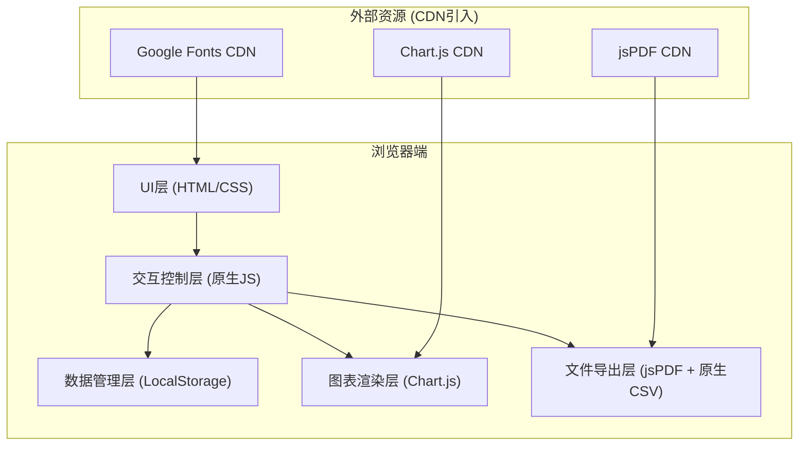

# 体检中心套餐定制与历年报告对比工具 - 技术架构文档

## 1. 架构设计

本系统采用纯前端单页应用(SPA)架构，所有逻辑运行在浏览器端，无需后端服务。数据通过 LocalStorage 持久化存储在用户本地。导出功能通过前端第三方库直接生成文件供用户下载。



## 2. 技术选型说明

| 层次 | 技术 | 版本/说明 | 选择理由 |
|------|------|-----------|----------|
| 标记语言 | HTML5 | - | 语义化标签，良好的表单支持 |
| 样式语言 | CSS3 | - | 原生CSS变量、Grid/Flex布局、动画效果，无需编译 |
| 编程语言 | 原生JavaScript (ES6+) | - | 用户明确要求，无需构建工具，浏览器直接运行 |
| 图表库 | Chart.js | 4.x (CDN) | 轻量级折线图支持良好，原生Canvas绘制，API简洁 |
| PDF导出 | jsPDF + html2canvas | 2.x + 1.x (CDN) | 支持中文(需配置字体)，可将DOM节点转为PDF，纯前端实现 |
| 字体服务 | Google Fonts | - | Noto Serif SC + Noto Sans SC，中文字体支持完善 |
| 数据持久化 | LocalStorage API | HTML5原生 | 无需后端，小体量JSON数据存储足够 |
| CSV导出 | 原生Blob API | - | 无需第三方库，纯JS拼接字符串生成CSV |

## 3. 目录与文件结构

```
d:\code\TraeProjects\1504\
├── index.html              # 入口HTML文件，包含所有视图结构
├── styles.css              # 全局样式文件，含CSS变量、布局、组件样式
├── app.js                  # 主逻辑文件，按模块划分代码块
└── .trae\
    └── documents\
        ├── PRD.md
        └── technical-architecture.md
```

**文件职责划分：**

| 文件 | 职责 | 关键内容 |
|------|------|----------|
| index.html | 页面结构 | 品牌头部、Tab导航、套餐定制区、报告对比区、各子模块DOM结构、CDN脚本引用 |
| styles.css | 视觉样式 | CSS变量(主题色)、字体定义、布局(Grid/Flex)、卡片/按钮/表单/标签样式、动画、响应式媒体查询 |
| app.js | 逻辑控制 | 数据常量(套餐/项目/正常值/健康建议规则)、状态管理、事件绑定、Tab切换、价格计算、趋势分析、图表渲染、PDF/CSV导出 |

## 4. 数据模型设计

### 4.1 核心数据结构

```javascript
// 1. 体检项目
ExamItem = {
  id: string,           // 唯一ID，如 'CBC'
  name: string,         // 项目名称，如 '血常规'
  category: string,     // 分类：'检验检查'|'影像检查'|'功能检查'|'专科检查'
  price: number,        // 标价（元）
  isHot: boolean        // 是否热门项目
}

// 2. 预设套餐
PresetPackage = {
  id: string,           // 'ENTRY'|'YOUNG_FEMALE'|'YOUNG_MALE'|'MIDDLE_AGED'|'GOLD_COLLAR'
  name: string,         // 套餐名
  description: string,  // 适用人群描述
  baseDiscount: number, // 基础折扣 0-1，如 0.9 = 9折
  itemIds: string[]     // 包含项目ID列表
}

// 3. 用户选择状态（套餐定制页）
PackageState = {
  selectedItemIds: string[],  // 当前勾选的所有项目ID
  userAge: number,            // 用户输入年龄
  userGender: 'male'|'female' // 用户输入性别
}

// 4. 单份体检报告
ExamReport = {
  year: number,           // 体检年份
  indicators: {           // 指标键值对
    systolicBP: number,   // 收缩压
    diastolicBP: number,  // 舒张压
    fastingGlucose: number, // 空腹血糖
    totalCholesterol: number, // 总胆固醇
    triglyceride: number,    // 甘油三酯
    hdlCholesterol: number,  // 高密度脂蛋白
    ldlCholesterol: number,  // 低密度脂蛋白
    creatinine: number,      // 肌酐
    uricAcid: number,        // 尿酸
    alt: number,             // 谷丙转氨酶
    ast: number,             // 谷草转氨酶
    bmi: number              // BMI
  }
}

// 5. 指标正常值范围与建议规则
IndicatorRule = {
  key: string,                // 对应指标字段
  name: string,               // 中文名
  unit: string,               // 单位
  minNormal: number,          // 正常值下限
  maxNormal: number,          // 正常值上限
  color: string,              // 图表颜色
  highAdvice: string,         // 偏高时建议
  lowAdvice: string           // 偏低时建议
}
```

### 4.2 LocalStorage 存储键

| Key | 数据类型 | 说明 |
|-----|----------|------|
| `hc_user_info` | `{age, gender}` | 用户年龄性别 |
| `hc_package_state` | `{selectedItemIds: string[]}` | 套餐定制当前选择 |
| `hc_exam_reports` | `ExamReport[]` | 历年报告列表 |

## 5. 核心业务逻辑规则

### 5.1 价格计算规则
```
已选项目原价总和 = Σ (已选项目.price)
基础套餐折扣判断：
  - 若勾选集合完全匹配某预设套餐 → 按该套餐 baseDiscount 计算
  - 否则：
    - 项目数 ≥ 15 → 8.5折
    - 项目数 ≥ 10 → 9折
    - 项目数 ≥ 5 → 9.5折
    - 项目数 < 5 → 无折扣
最终总价 = 原价总和 × 折扣
```

### 5.2 趋势判断规则
对同一指标的多年数据（按年份排序）：
```
设数据点为 [v₁, v₂, ..., vₙ]，年份升序
计算逐年变化差 dᵢ = vᵢ₊₁ - vᵢ，i=1..n-1

- 逐年升高：所有 dᵢ > 0，且平均变化率 > 正常值范围宽度 × 5%
- 逐年降低：所有 dᵢ < 0，且平均变化率 < -正常值范围宽度 × 5%
- 稳定：否则（含波动）
```

### 5.3 异常判断规则
```
对指标值 v 属于 [minNormal, maxNormal] 正常
- v > maxNormal → 偏高，红字显示，触发 highAdvice
- v < minNormal → 偏低，红字显示，触发 lowAdvice
```

### 5.4 加项推荐规则
按年龄×性别匹配规则表，取前3个未选项目：

| 匹配条件 | 推荐项目 |
|----------|----------|
| 男性 ≥ 40岁 | PSA(前列腺特异抗原)、肺CT、颈动脉彩超 |
| 男性 30-39岁 | 甲状腺彩超、颈椎片、幽门螺杆菌 |
| 女性 ≥ 40岁 | 乳腺钼靶、TCT+HPV、骨密度 |
| 女性 30-39岁 | HPV分型、甲状腺彩超、乳腺彩超 |
| 女性 <30岁 | 妇科常规、乳腺彩超、HPV |
| 通用 ≥ 50岁 | 头部CT、胃肠镜、肿瘤标志物全项 |
| 通用 40-49岁 | 肿瘤标志物5项、骨密度、经颅多普勒 |

## 6. 关键模块与算法

### 6.1 模块划分（app.js 内部）
```
┌───────────────────────────────────────────────┐
│                   APP INIT                    │
│  - 常量数据定义(套餐/项目/指标规则/推荐规则)    │
│  - 初始化状态(从LocalStorage读取)              │
│  - 绑定所有事件                                │
├───────────────┬───────────────┬───────────────┤
│ 套餐定制模块   │ 报告对比模块   │ 导出模块       │
│ - 套餐卡片渲染 │ - 报告列表管理 │ - 报价单PDF    │
│ - 项目库渲染   │ - 指标录入表单 │ - 套餐CSV      │
│ - 勾选处理     │ - 趋势分析算法 │ - 对比PDF      │
│ - 价格计算     │ - 图表渲染     │ - 指标CSV      │
│ - 加项推荐     │ - 异常&建议    │               │
└───────────────┴───────────────┴───────────────┘
```

### 6.2 图表渲染（折线图）
- 使用 Chart.js 的 Line Chart 类型
- 每条指标一条折线，颜色取自 IndicatorRule.color
- X轴：年份升序排列
- Y轴：数值范围自适应（或参考正常值范围）
- 数据点：圆点标记，悬停显示具体数值
- 正常范围：使用 `fill-between` 插件或 `annotation` 绘制参考区间

### 6.3 PDF导出
- 套餐报价单：html2canvas 抓取"已选项目汇总栏"+"价格区" DOM节点 → jsPDF 生成A4 PDF
- 报告对比：截图图表区 + 异常建议区 → 拼接成多页PDF
- 中文字体：使用 base64 内嵌 NotoSansSC 子集字体，确保中文不乱码

### 6.4 CSV导出
- 套餐CSV：列(项目ID, 项目名, 分类, 单价, 是否选中, 小计) + 末尾行(原价, 折扣, 总价)
- 指标CSV：首列(年份), 其余列(各指标名), 每行一年数据
- 实现：字符串拼接 → Blob(text/csv) → a[download] 触发下载
